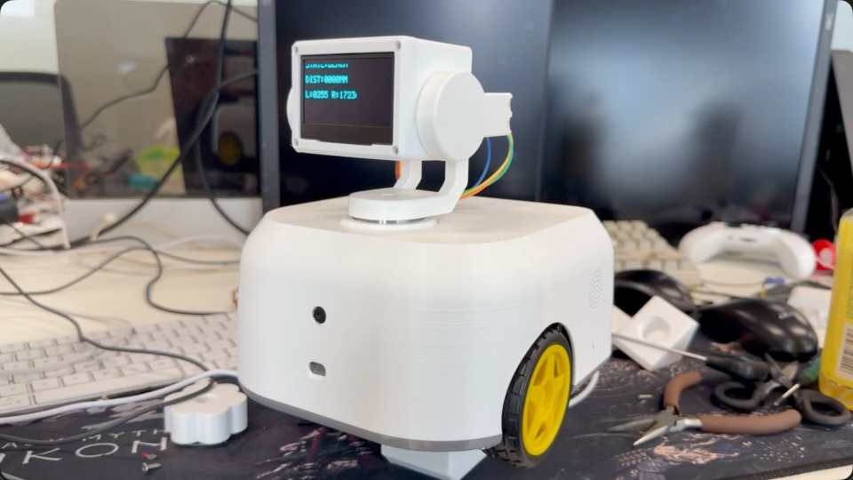
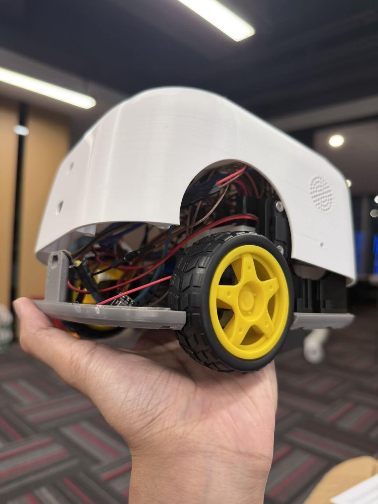
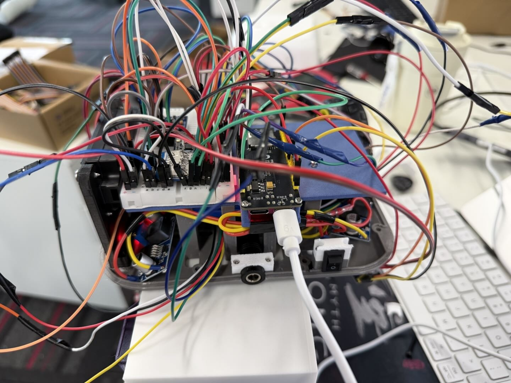

# ESP32-S3 Robot Car

这是当前 ESP32-S3 双轮机器人小车的硬件与机械基线资料库，用于后续重新开发控制软件。仓库记录已经装配过的实物、供电与接口、机械装配、接线方法和硬件验证结论。

## 仓库范围

本仓库包含：

- ESP32-S3、传感器、执行器和供电模块清单
- 电源分配、GPIO、接口和接线关系
- 底盘、外壳、云台及内部模块装配说明
- 完整 STEP 装配文件和实物照片
- 已验证的硬件状态、遗留问题和安全注意事项

本仓库不包含固件、算法、控制参数、构建环境或可直接烧录的程序。STEP 是机械几何的权威来源；未提供的材料、紧固件、尺寸工程图和打印参数不会在文档中推测补全。

## 硬件概览

| 子系统 | 当前配置 |
|---|---|
| 主控 | ESP32-S3 开发板 |
| 驱动 | TB6612 双路直流电机驱动 |
| 行走机构 | 2 个 6Pin 霍尔编码器 TT 电机及轮组 |
| 视觉 | OV3660 FPC 摄像头 |
| 云台 | 2 个 SG90，分别控制 Yaw 和 Pitch |
| 传感器 | TOF、MPU6050、INMP441 |
| 人机交互 | 2.42 英寸 SSD1309 OLED、TTS 模块、4Ω 3W 3070 扬声器 |
| 电源 | 12V 主电源，分别降压为 6V 和 5V；主控提供 3V3 逻辑电源 |
| 结构 | 双轮底盘、打印外壳、顶部双轴云台及显示器外壳 |

## 文档导航

- [硬件 BOM](docs/bom.md)
- [供电、接口与接线](docs/wiring.md)
- [机械装配与布线](docs/assembly.md)
- [硬件验证状态](docs/validation.md)
- [机械 CAD 说明](mechanical/README.md)
- [高清接线图](assets/diagrams/wiring-overview.png)

## 实物视图

| 外形视图 | 内部原型接线 |
|---|---|
|  |  |

内部照片记录的是调试阶段的面包板与杜邦线接线，不应视为适合长期振动环境的最终线束方案。

## 首要安全规则

1. 断电状态下接线或调整 FPC，任何模块异常发热、异味或冒烟都应立即断电。
2. 12V 只进入两个降压模块的输入端，不能直接进入 ESP32-S3、传感器或面包板信号区。
3. LM2596-A 输出约 6V，仅供 TB6612 的 `VM`；LM2596-B 输出约 5V，供主控、TTS 和舵机。
4. 所有模块必须共地，但 3V3、5V、6V、12V 不得互连。
5. 电机与舵机初次上电时固定车体或架空车轮，避免车辆突然移动。

## 权利声明

当前仓库未附加开源许可证，默认保留全部权利。
