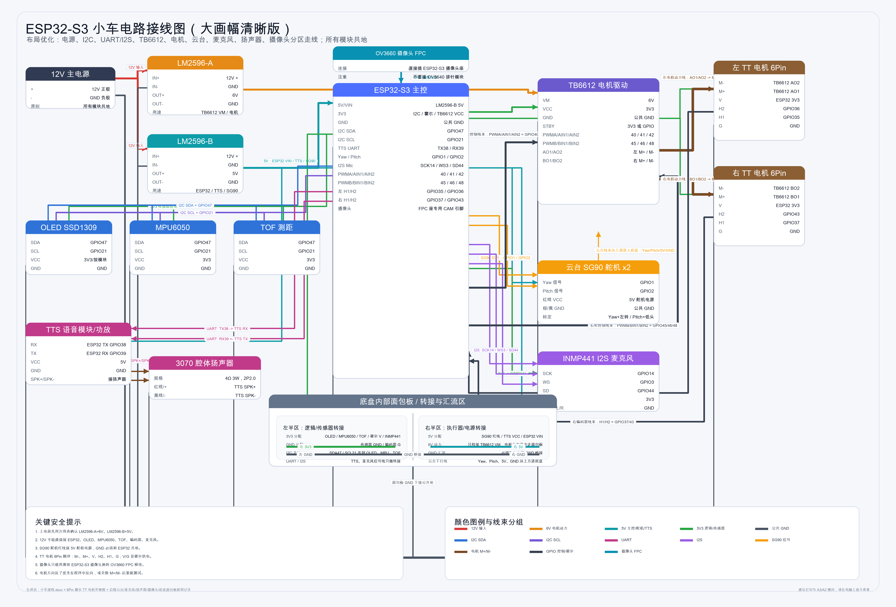

# 供电、接口与接线

> 接线图是整车关系总览，下面的表格用于逐项核对。摄像头按当前实物确认的 OV3660 记录。

## 电源域

| 电源节点 | 来源 | 连接对象 | 注意事项 |
|---|---|---|---|
| 12V | 主电源正极 | LM2596-A/B 的 `IN+` | 不进入 ESP32-S3、传感器或普通面包板电源排 |
| 6V | LM2596-A `OUT+` | TB6612 `VM` | 只作为 TT 电机动力电源 |
| 5V | LM2596-B `OUT+` | ESP32-S3 `5V/VIN`、TTS、两个 SG90 | 舵机启动电流较大，导线和降压能力需要留余量 |
| 3V3 | ESP32-S3 `3V3` | TB6612 `VCC/STBY`、OLED、MPU6050、TOF、编码器 `V`、INMP441 | 只供逻辑与小功率模块 |
| GND | 12V 负极和所有电源负端 | 全部模块 | 所有模块共地，建议设置明确的公共地汇流点 |

### 调压顺序

1. 断开所有后级负载，只给两个 LM2596 接入 12V。
2. 测量 `OUT+` 与 `OUT-`，把 A 路调到约 6.0V。
3. 把 B 路调到约 5.0V。
4. 断电后再连接 TB6612、ESP32-S3 和外设。
5. 首次上电观察模块温度，并复测各电源域对 GND 的电压。

## GPIO 与通信接口

| 子系统 | 信号 | ESP32-S3 GPIO | 外设端 |
|---|---|---:|---|
| 左电机 | PWM | GPIO40 | TB6612 `PWMA` |
| 左电机 | 方向 1/2 | GPIO41 / GPIO42 | TB6612 `AIN1/AIN2` |
| 右电机 | PWM | GPIO45 | TB6612 `PWMB` |
| 右电机 | 方向 1/2 | GPIO46 / GPIO48 | TB6612 `BIN1/BIN2` |
| 左编码器 | H1/H2 | GPIO35 / GPIO36 | 左 TT 电机 `H1/H2` |
| 右编码器 | H1/H2 | GPIO37 / GPIO43 | 右 TT 电机 `H1/H2` |
| I2C | SDA/SCL | GPIO47 / GPIO21 | OLED、MPU6050、TOF 共线 |
| TTS UART | ESP TX / ESP RX | GPIO38 / GPIO39 | TTS `RX/TX`，交叉连接 |
| 云台 | Yaw/Pitch | GPIO1 / GPIO2 | 两个 SG90 信号线 |
| INMP441 | SCK/WS/SD | GPIO14 / GPIO3 / GPIO44 | I2S 时钟、帧同步、数据 |

> **资源冲突警告：** 当前整机把编码器信号连接到 GPIO35、GPIO36 和
> GPIO37；这些引脚同时属于当前 ESP32-S3 的 Octal PSRAM 总线。当前接线
> 状态下，Camera Benchmark 和 Camera Streaming 固件都在 PSRAM 初始化阶段
> 失败并重启。尚未完成断开编码器连接的 A/B 测试，因此不能把编码器外部
> 连接写成已验证的直接根因。重新开发前必须重新分配编码器 GPIO，并先完成
> 断线 A/B 验证。

## TB6612 与 TT 电机

TB6612 的 `VM` 与 `VCC` 是不同电源：`VM` 接 6V，`VCC` 接 3V3，`STBY` 在当前基线中建议直接拉到 3V3。

| 电机接口 | 含义 | 左侧连接 | 右侧连接 |
|---|---|---|---|
| `M-` | 电机动力端 | TB6612 `AO2` | TB6612 `BO2` |
| `M+` | 电机动力端 | TB6612 `AO1` | TB6612 `BO1` |
| `V` | 霍尔编码器正极 | 3V3 | 3V3 |
| `H2` | 霍尔信号 2 | GPIO36 | GPIO43 |
| `H1` | 霍尔信号 1 | GPIO35 | GPIO37 |
| `G` | 霍尔编码器负极 | GND | GND |

不同批次 TB6612 模块的排针顺序可能不同，必须按实物丝印核对。若轮子方向不符合机械前进方向，可交换该电机 `M+ / M-`；编码器方向则由 `H1/H2` 相位定义，应独立核对。

## I2C 模块

OLED、MPU6050 和 TOF 共用 GPIO47/GPIO21。三者使用 3V3 和公共 GND，不得连接 5V、6V 或 12V。已确认的基线地址为 TOF `0x29`、MPU6050 `0x68`；OLED 曾经能够正常显示，但不保证在通用地址扫描中始终应答。

## TTS、扬声器、舵机与麦克风

- ESP32-S3 GPIO38 发送到 TTS `RX`，GPIO39 接收 TTS `TX`。
- 3070 扬声器只接 TTS 或功放的 `SPK+ / SPK-`，不能直接接 GPIO 或电源脚。
- 两个 SG90 的红线接 5V，棕/黑线接 GND，Yaw/Pitch 信号分别接 GPIO1/GPIO2。
- INMP441 的 `VDD` 接 3V3，`GND` 接公共地，`SCK/WS/SD` 分别接 GPIO14/GPIO3/GPIO44，单麦克风基线中 `L/R` 接 GND。

## OV3660 摄像头接口

当前实物使用与 ESP32-S3 开发板摄像头座匹配的 OV3660 FPC 模块。应在断电状态下插拔，金手指方向和锁扣必须按开发板摄像头座确认。不要根据 GPIO 表直接给裸 FPC 飞线。

| 摄像头信号 | GPIO | 摄像头信号 | GPIO |
|---|---:|---|---:|
| SIOD | 4 | SIOC | 5 |
| VSYNC | 6 | HREF | 7 |
| XCLK | 15 | PCLK | 13 |
| Y2 | 11 | Y3 | 9 |
| Y4 | 8 | Y5 | 10 |
| Y6 | 12 | Y7 | 18 |
| Y8 | 17 | Y9 | 16 |

这些 GPIO 描述的是当前开发板基线，不等同于 FPC 触点编号。更换开发板或转接板时必须重新核对原理图和丝印。

## 上电前核对

- 12V 正极与 GND 不短路，电源极性正确。
- A 路约 6V，B 路约 5V，ESP32-S3 的 3V3 输出正常。
- TB6612 `VM=6V`、`VCC=3V3`、`STBY` 为高电平且 GND 共地。
- 5V、6V、3V3 电源排之间不导通。
- 摄像头 FPC 插到底、锁扣闭合、没有死折或被外壳压住。
- 电机动力线远离 I2C、I2S 和摄像头排线。
